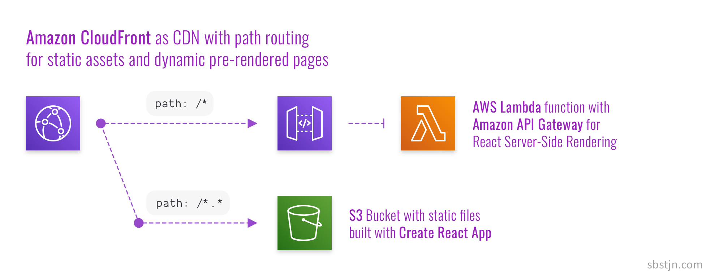

# Serverless SSR for [create-react-app][cra]

[](https://github.com/sbstjn/cra-serverless/blob/master/LICENSE.md)
[](https://sbstjn.com)

> Resilient architecture to use [Server-Side Rendering][ssr] for any [create-react-app][cra] project on Amazon Web Services using Lambda, API Gateway, CloudFront. All infrastructure is configured using the [AWS Cloud Development Kit][cdk] and can be deployed using [AWS CodePipeline][pipeline] and [AWS CodeBuild][codebuild].

Whenever you search for server-side rendering of React applications, you will read it's hard to accomplish. But why? Most probably, you'll end up with frameworks like [razzle](https://github.com/jaredpalmer/razzle) or [Next.js](https://nextjs.org/) only because you wanted a little bit of pre-rendered HTML for your React application.

The idea of **cra-serverless** is pretty simple: Use your existing, default, unejected, and unpatched [create-react-app][cra] and replace `BrowserRouter` with `StaticRouter`, deploy it to AWS Lambda, and finally put a CDN in front of it. You'll have your same React SPA, but now you can have pre-rendered HTML content for all routes in your application. This event works fine with frameworks like [styled-components][sc] or [apollo client][apollo] for using [GraphQL on AppSync][appsync].



## Architecture

- TypeScript, for God's sake.
- Default **(un-ejected)** [create-react-app][cra] stored `./src`
- **SSR** using `react-dom/server` and [koa][koa] in `./server`
- **Infrastructure as Code** using [AWS Cloud Development Kit][cdk] in `./aws`
- [AWS Lambda][lambda] for server-side (pre-)rendering of **React SPA**
- [AWS CodePipeline][pipeline] and [AWS CodeBuild][codebuild] for **Continious Deployments**

## Deployments and Configuration

Based on [cra-pipeline][cra-pipeline], all you need is a [personal GitHub Access Token][token] and your own fork of this repository. If you have both things in place, store the token in [AWS Systems Manager][sm]:

```bash
$ > aws secretsmanager create-secret \
    --name GitHubToken \
    --secret-string abcdefg1234abcdefg56789abcdefg \
    --region us-east-1

{
  "ARN": "arn:aws:secretsmanager:us-east-1:123456789001:secret:GitHubToken-uNBxTr",
  "Name": "GitHubToken",
  "VersionId": "4acda3d1-877f-4032-b38e-17bc50239883"
}
```

As everything is configured using [AWS Cloud Development Kit][cdk], you need to prepare (_aka bootstrap_) your AWS account once for the usage of the **CDK** in your desired AWS region:

```bash
$ > yarn cdk bootstrap --region us-east-1

⏳  Bootstrapping environment aws://123456789001/us-east-1...

0/2 | 5:06:49 PM | CREATE_IN_PROGRESS   | AWS::S3::Bucket | StagingBucket
0/2 | 5:06:50 PM | CREATE_IN_PROGRESS   | AWS::S3::Bucket | StagingBucket Resource creation Initiated
1/2 | 5:07:11 PM | CREATE_COMPLETE      | AWS::S3::Bucket | StagingBucket

✅  Environment aws://123456789001/us-east-1 bootstrapped.
```

Next, have a look at the `./config.ts` file in the root folder and configure at least the `github` section of the file.

```typescript
export const config = {
  name: 'cra-serverless',
  github: {
    owner: 'sbstjn',
    repository: 'cra-serverless',
  },
  env: { region: 'us-east-1' },
}
```

After changing the GitHub repository information, just deploy the CloudFormation stack for the included [AWS CodePipeline][pipeline] and all resources will be created for you.

```bash
$ > yarn cdk deploy cra-serverless-pipeline

Pipeline: deploying...
Pipeline: creating CloudFormation changeset...

✅  Pipeline
```

Head over to the [AWS Management Console][console] and watch the beauty of a deploy pipeline and CloudFormation stacks. All resources will be created for you, and after a while a [CloudFront Distribution][cloudfront] is available for the included example application.

## Further Reading

- [**sbstjn.com**](https://sbstjn.com) for a detailed guide in English
- [**superluminar.io**](https://superluminar.io) for a detailed guide in German

## License

Feel free to use the code, it's released using the [MIT license](LICENSE.md).

## Contribution

You are welcome to contribute to this project! 😘

To make sure you have a pleasant experience, please read the [code of conduct](CODE_OF_CONDUCT.md). It outlines core values and beliefs and will make working together a happier experience.

[cloudfront]: https://aws.amazon.com/cloudfront/
[console]: https://aws.amazon.com/console/
[sm]: https://aws.amazon.com/systems-manager/
[token]: https://github.com/settings/tokens
[cra-pipeline]: https://github.com/sbstjn/cra-pipeline
[lambda]: https://aws.amazon.com/lambda/
[appsync]: https://aws.amazon.com/appsync/
[apollo]: https://www.apollographql.com/docs/react/
[sc]: https://styled-components.com
[cra]: https://create-react-app.dev/
[ssr]: https://reactjs.org/docs/react-dom-server.html
[cdk]: https://docs.aws.amazon.com/cdk/latest/guide/home.html
[koa]: https://koajs.com/
[codebuild]: https://aws.amazon.com/codebuild/
[pipeline]: https://aws.amazon.com/codepipeline/
